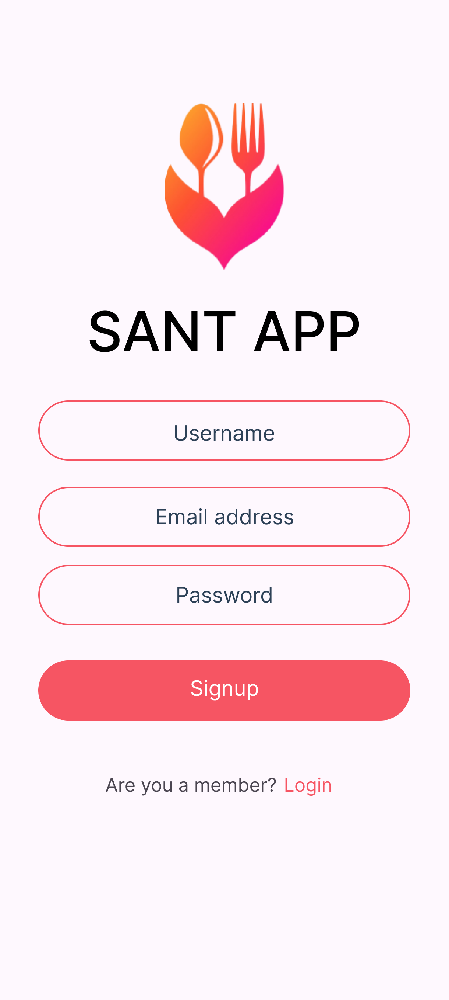
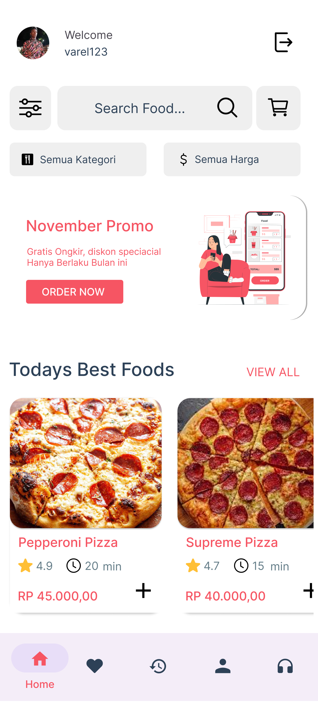
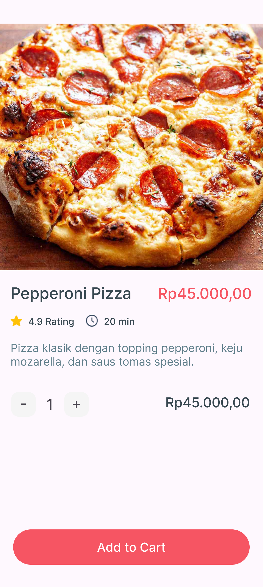
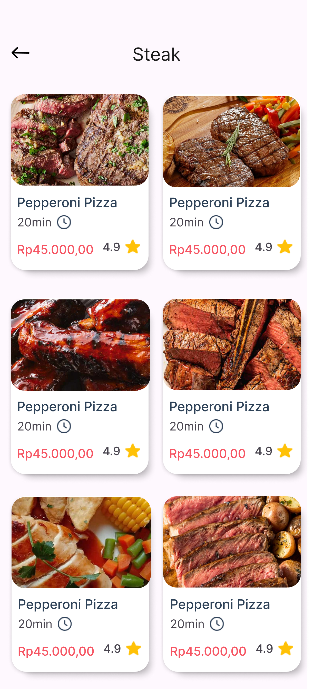
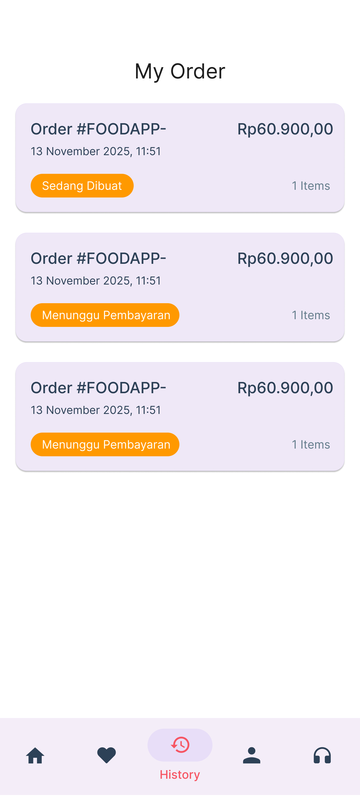
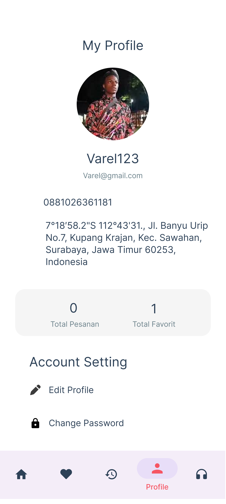
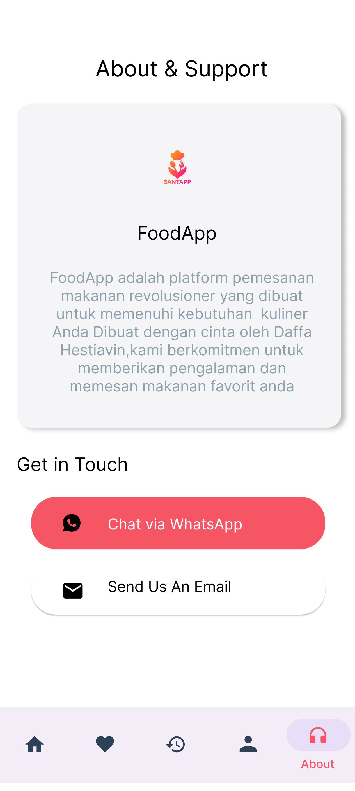

# 🍽️ Santaap – Aplikasi Pemesanan Makanan

## 📌 Deskripsi Project

**Santaap** adalah aplikasi pemesanan makanan berbasis **Android** yang dikembangkan sebagai **Project Akhir Mata Kuliah Pemrograman Mobile** di Universitas Negeri Surabaya. Aplikasi ini bertujuan untuk menggantikan sistem pemesanan makanan konvensional (chat/telepon) menjadi sistem digital yang lebih **efisien, aman, dan real-time**.
Aplikasi Santaap memungkinkan pengguna untuk melihat menu makanan, menambahkan ke keranjang, melakukan checkout, serta membayar secara online melalui **Midtrans Payment Gateway**. Seluruh data pengguna, menu, dan pesanan dikelola menggunakan **Firebase**.

---

## 🎯 Tujuan Pengembangan

* Menyediakan solusi pemesanan makanan digital berbasis Android
* Mengintegrasikan sistem pembayaran online yang aman (Midtrans)
* Mempermudah pengelolaan data menu dan pesanan menggunakan Firebase
* Memberikan pengalaman pengguna yang praktis dan user-friendly

---

## 🛠️ Teknologi yang Digunakan

* **Platform**: Android
* **IDE**: Android Studio
* **Bahasa Pemrograman**: Java
* **Frontend**: XML
* **Backend & Database**: Firebase (Authentication & Realtime Database)
* **Payment Gateway**: Midtrans (Sandbox)
* **Build System**: Gradle
* **Minimum Android Version**: Android 8.0 (API 26)

---

## ✨ Fitur Utama

* Membuat akun pengguna dengan memasukan Email, Username Dan Password
* Melakukan Pemasanan makanan dan minuman 
* Fitur Pencarian dan Kategori makanan
* Fitur Favorite, History, Profile dan Masukan Pengguna
* Fitur Keranjang Cart Dan Simulasi Pembayaran Via Midtrans 


### 👤 Konsumen

* Registrasi & Login pengguna
* Melihat daftar menu makanan
* Pencarian dan filter makanan
* Menambahkan makanan ke keranjang (Cart)
* Mengelola keranjang (tambah, hapus, ubah jumlah)
* Checkout dan pembayaran online via Midtrans
* Melihat riwayat pesanan
* Menandai makanan favorit
* Manajemen profil pengguna

### 🛠️ Admin / Penjual

* Login admin
* Menambahkan, mengubah, dan menghapus menu makanan (CRUD)
* Monitoring pesanan secara real-time
* Integrasi pembayaran Midtrans (mode sandbox)

---

## 📂 Struktur Project (Sederhana)

```text
app/
 \---com
    \---example
        \---foodapp
            |   MyApplication.java
            |   
            +---Activity
            |       BaseActivity.java
            |       CartActivity.java
            |       DetailActivity.java
            |       EditProfileActivity.java
            |       FavoriteFragment.java
            |       HomeFragment.java
            |       IntroActivity.java
            |       ListFoodsActivity2.java
            |       LoginActivity.java
            |       MainActivity.java
            |       OrdersFragment.java
            |       ProfileFragment.java
            |       SignupActivity.java
            |       SupportFragment.java
            |
            +---Adapter
            |       BestFoodsAdapter.java
            |       CartAdapter.java
            |       CategoryAdapter.java
            |       FoodListAdapter.java
            |       OrderHistoryAdapter.java
            |       PromoSliderAdapter.java
            |
            +---Domain
            |       Category.java
            |       FilterCategory.java
            |       Foods.java
            |       Location.java
            |       Order.java
            |       Price.java
            |       Promo.java
            |       Time.java
            |
            \---Helper
                    ChangeNumberItemsListener.java
                    ManagmentCart.java
                    TinyDB.java

```

---

## ▶️ Cara Menjalankan Project

1. Clone repository ini:

   ```bash
   git clone https://github.com/username/santaap.git
   ```
2. Buka project menggunakan **Android Studio**
3. Pastikan file `google-services.json` sudah terkonfigurasi
4. Lakukan **Gradle Sync**
5. Jalankan aplikasi pada emulator atau perangkat Android

---


## 📸 Screenshot Aplikasi

Berikut adalah tampilan aplikasi Santap:


*Halaman SIGN*


*Halaman Utama*


*Halaman Detail*


*Halaman Card*


*Halaman Favorite*


*Halaman History*


*Halaman Profile*


*Halaman About*

---

## 👨‍🎓 Tim Pengembang

Project ini dikembangkan Kembali oleh:

* **Rahmat Ferdiyansyah** (24050974100)
* **Ahmad Alwi Tio Wicaksono** (24050974098)
* **Muhammad Hestiavin Daffa** (24050974117) – Ketua Kelompok

Program Studi **Pendidikan Teknologi Informasi**
Fakultas Teknik, Universitas Negeri Surabaya
Tahun 2025

---

## 📄 Lisensi

Project ini dibuat untuk **keperluan akademik dan pembelajaran**. Bebas digunakan sebagai referensi dengan mencantumkan sumber.
